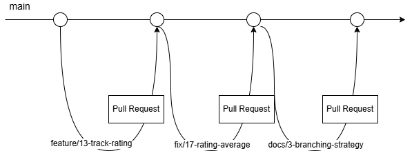

# Стратегія розгалуження

## Обрана стратегія

Для проєкту використовується GitHub Flow. Ця стратегія підходить для індивідуальної розробки прототипу, оскільки зміни додаються невеликими частинами, а готові результати перевіряються перед злиттям у головну гілку.

## Призначення гілок

- `main` містить актуальну стабільну версію проєкту
- `feature/<номер-issue>-<коротка-назва>` використовується для нової функції
- `fix/<номер-issue>-<коротка-назва>` використовується для виправлення помилки
- `docs/<номер-issue>-<коротка-назва>` використовується для зміни документації

Назви гілок пишуться англійською мовою, малими літерами, без пробілів. Слова розділяються дефісами.

Приклади:

- `docs/3-branching-strategy`
- `feature/13-track-rating`
- `fix/17-rating-average`

## Порядок роботи

1. Перед початком роботи оновлюється локальна гілка main
2. Для окремого Issue створюється окрема гілка від main
3. Зміни додаються в цю гілку та фіксуються комітом із коротким зрозумілим повідомленням
4. Після завершення роботи створюється Pull Request із цієї гілки до main
5. У Pull Request вказується пов'язане Issue, наприклад Closes #3
6. Зміни перевіряються за критеріями приймання Issue
7. Після успішної перевірки Pull Request зливається в main
8. Після злиття робоча гілка видаляється, а стан завдання оновлюється на дошці GitHub Projects

## Правила перевірки

Для документації перевіряється правильність шляху до файла, читабельність Markdown, наявність усіх потрібних розділів і відсутність секретних даних.

Оскільки проєкт виконується індивідуально, автор самостійно порівнює зміни з критеріями приймання Issue та зазначає результат самоперевірки у Pull Request.

## Схема роботи

